# React Performance

Deploy: [link](https://glowing-alpaca-aef718.netlify.app)

🚀 Performance Overview
This application implements comprehensive performance optimizations to handle large datasets efficiently while maintaining smooth user interactions.

### Sorting a column BEFORE

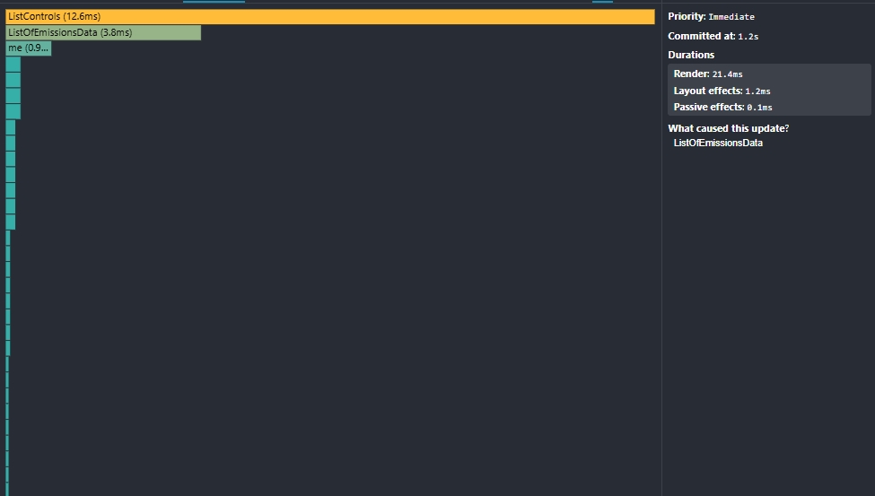
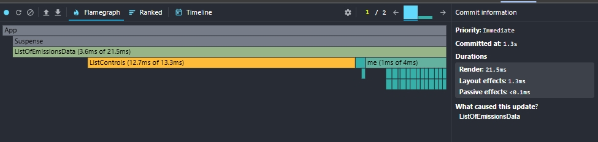

### Sorting a column AFTER

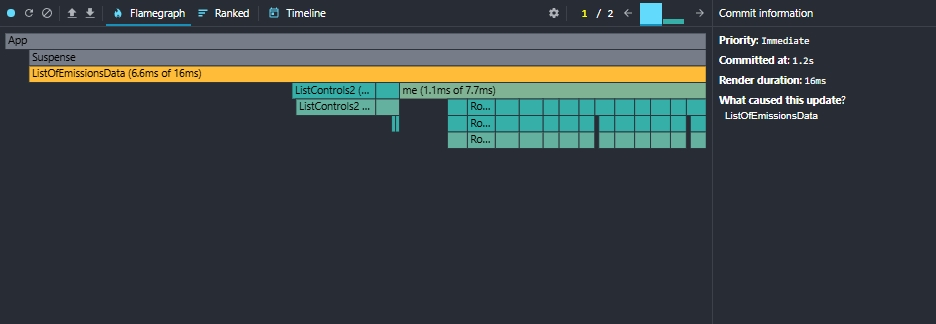
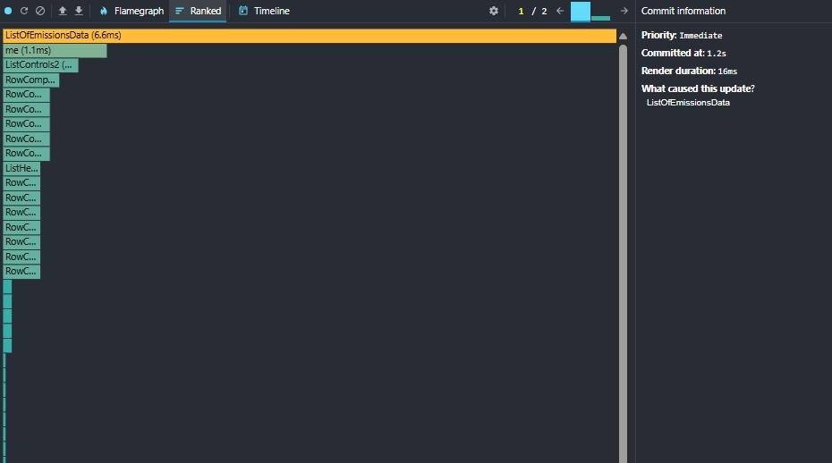

### Searching a country BEFORE

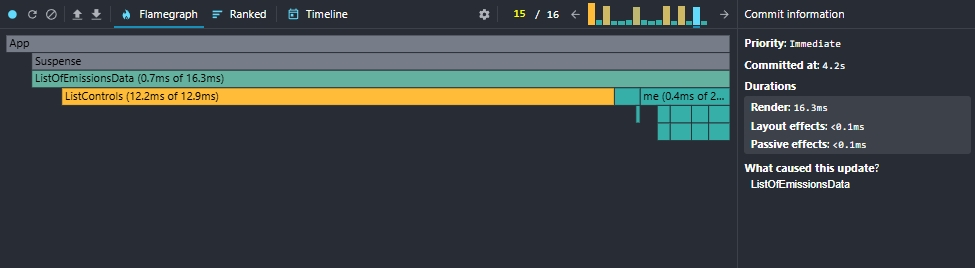
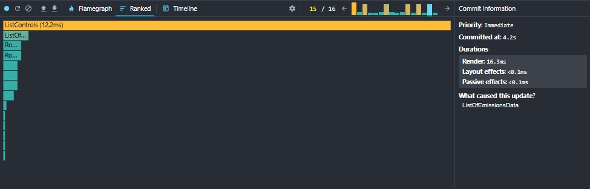

### Searching a country AFTER

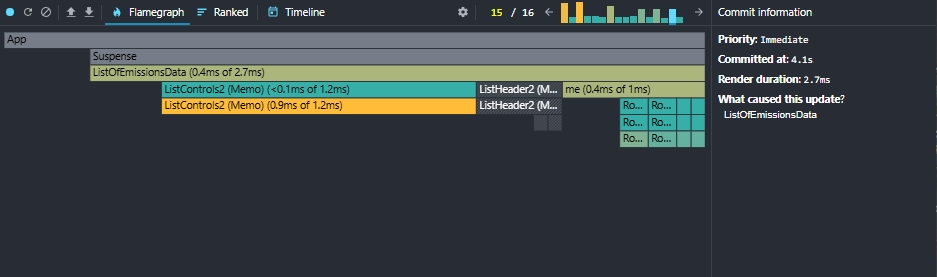

### Selecting another year BEFORE

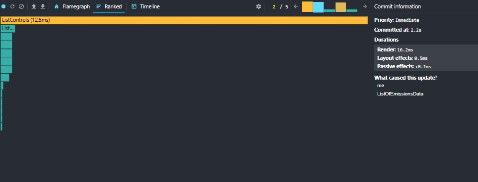
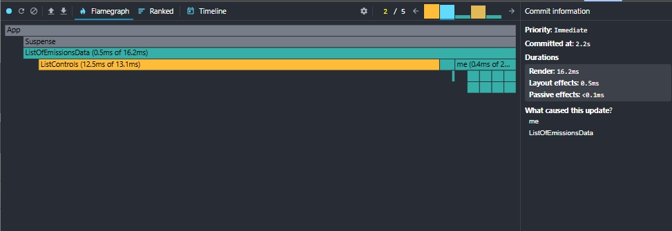

### Selecting another year AFTER

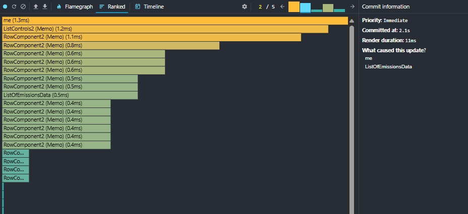
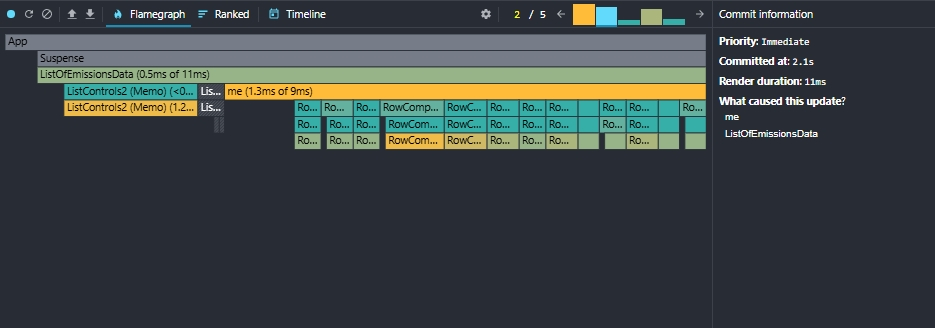

### Removing columns BEFORE

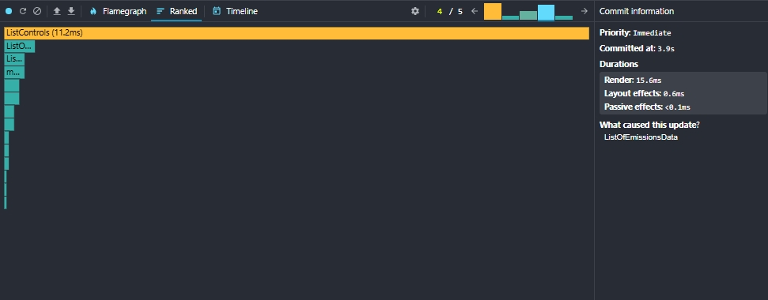
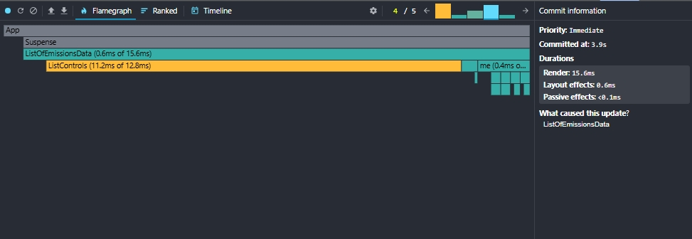

### Removing columns AFTER

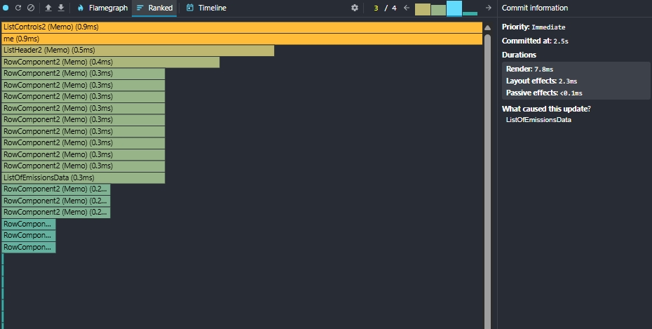
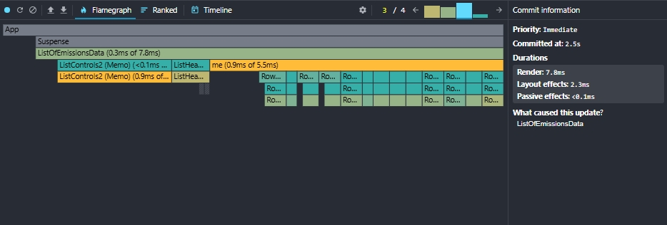

### Adding columns BEFORE

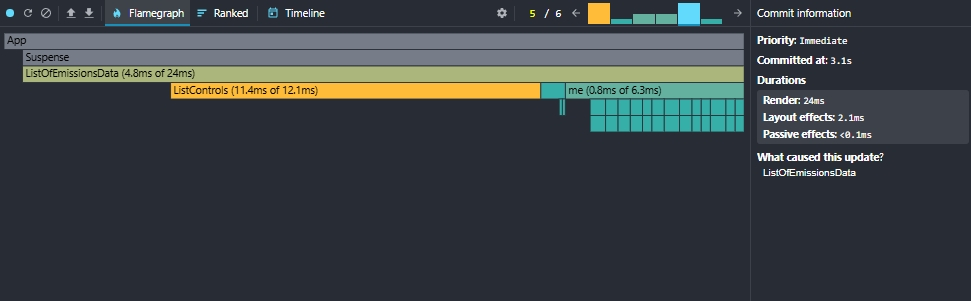
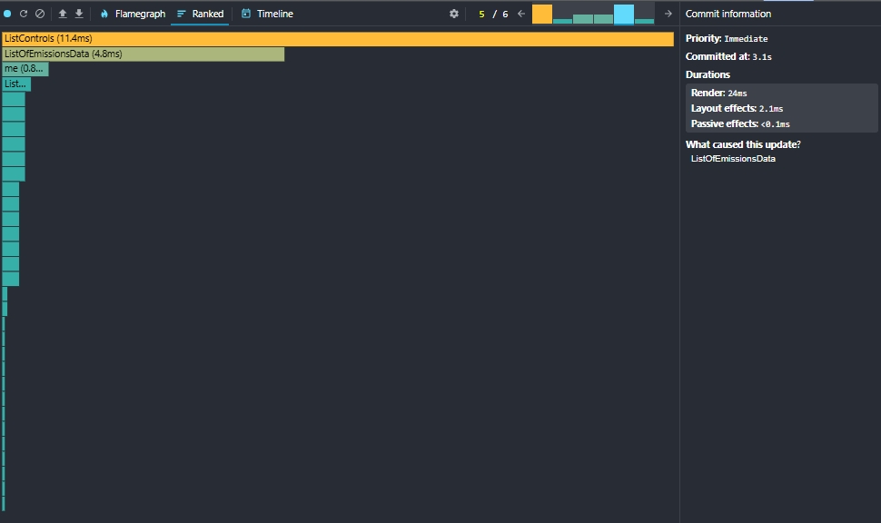

### Adding columns AFTER

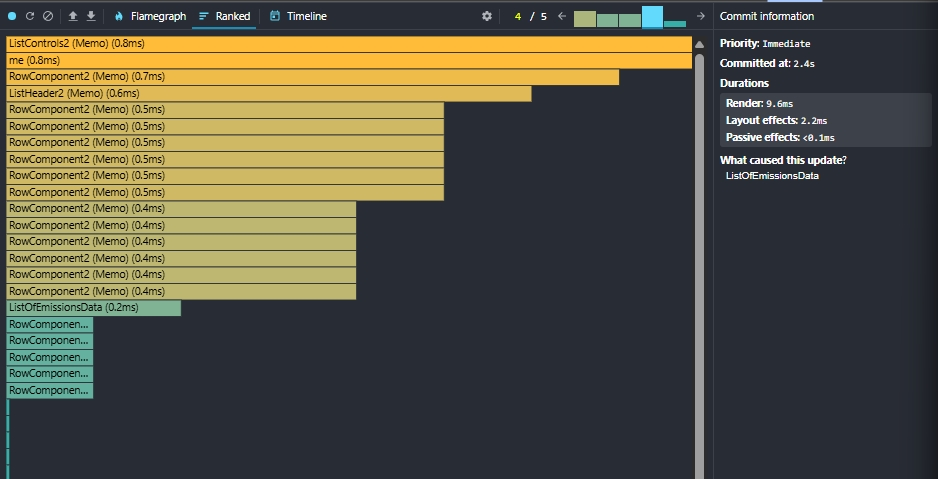
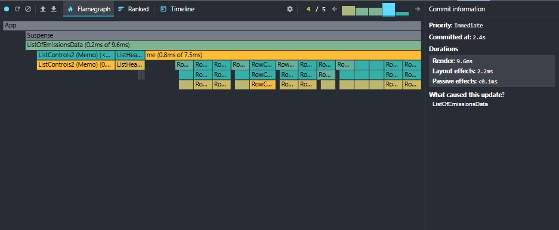
